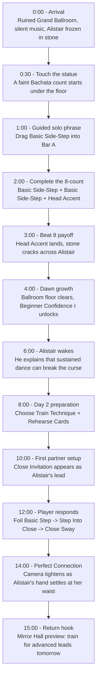

# Meta Horizon Creator Competition: Game Design

## Player Journey Map

**Game Title:** Dancing with Dracula: Crimson Manor

**Journey Focus:** First 15 minutes of onboarding, from Day 1 solo dance to Day 2 first partner dance.

---

## First 15 Minutes Flowchart



---

## Journey Table

| Stage | First 30 sec | ~1-3 min | ~3-8 min | ~8-15 min |
|---|---|---|---|---|
| What the player<br>sees & does | Enter the ruined Grand Ballroom. Alistair is frozen in stone. | Touch his hand. Complete a guided solo 8-count with Basic Side-Step and Head Accent. | Beat 8 cracks the stone. Dawn clears part of the Ballroom. Alistair wakes. | Train Technique, rehearse cards, then answer Close Invitation with Step Into Close. |
| Decision points | Tap the statue hand. | Place guided cards into Bar A / Bar B and attach Head Accent. | Accept the first growth reward: Beginner Confidence I. | Spend 2 Day Actions: Train Technique and Rehearse Cards into Foil Basic Step. |
| Challenge | Curiosity and orientation. | Guided timing: learn that 8 Beats make one phrase. | See cause and effect: good timing changes the curse. | Enter Close before Beat 5 to earn Perfect Connection. |
| Emotional beat | Gothic curiosity. | Vulnerability: she dances alone while the manor watches. | Wonder: her dance mattered. | Trust: the first partner dance turns Alistair into someone she must learn to read. |
| Return hook | Who is the statue? | Finish the first phrase. | Alistair is awake and Day 2 is promised. | Mirror Hall points to the next goal: train for smoother, closer, more advanced dances. |

---

## Key Onboarding Promise

The first 15 minutes should make one idea clear:

```text
Preparation changes the dance. The dance changes the manor.
```

Day 1 proves that dance has supernatural power. Day 2 proves that preparation creates better connection.

```text
Mortal outsider -> first solo rhythm -> stone cracks -> vampire wakes -> first partner connection -> tomorrow's training goal
```
