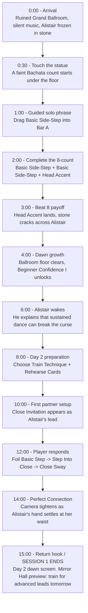

# Meta Horizon Creator Competition: Game Design

## Player Journey Map

Author: Erick Alberto Rea

**Game Title:** Eight Counts to Midnight

**Journey Focus:** First 15 minutes of onboarding, from Day 1 solo dance to Day 2 first partner dance.

---

## First 15 Minutes Flowchart



**Where the first session ends:** A natural stop lands at the Day 2 dawn screen (~15:00). The player has completed one full loop (solo awakening, first partner dance, first growth payoff) and is handed a clear reason to return. A shorter 5-10 minute session can end one beat earlier, at the Day 1 dawn growth (~4:00), which also closes a complete loop. Both endpoints leave the player on a reward and a forward hook, never mid-phrase.

---

## Journey Table

| Stage | First 30 sec | ~1-3 min | ~3-8 min | ~8-15 min |
|---|---|---|---|---|
| What the player<br>sees & does | Enter the ruined Grand Ballroom. Alistair is frozen in stone. | Touch his hand. Complete a guided solo 8-count with Basic Side-Step and Head Accent. | Beat 8 cracks the stone. Dawn clears part of the Ballroom. Alistair wakes. | Train Technique, rehearse cards, then answer Close Invitation with Step Into Close. |
| Decision points | Tap the statue hand. | Place guided cards into Bar A / Bar B and attach Head Accent. | Accept the first growth reward: Beginner Confidence I. | Spend 2 Day Actions: Train Technique and Rehearse Cards into Foil Basic Step. |
| Challenge | Curiosity and orientation. | Guided timing: learn that 8 Beats make one phrase. | See cause and effect: good timing changes the curse. | Enter Close before Beat 5 to earn Perfect Connection. |
| Emotional beat | Gothic curiosity. | Vulnerability: she dances alone while the manor watches. | Wonder: her dance mattered. | Trust: the first partner dance turns Alistair into someone she must learn to read. |
| Return hook | Who is the statue? | Finish the first phrase. | Alistair is awake and Day 2 is promised. | Mirror Hall points to the next goal: train for smoother, closer, more advanced dances. |

---

## Difficulty & Intensity Curve

The first 15 minutes follow a guided sawtooth: each new demand is taught, executed, then rewarded with a calm beat before the next, harder ask. Challenge never spikes without a prior teaching moment.

```text
Intensity
 High |                                   12:00 ____ 14:00
      |                        10:00 ___/        \  (Perfect
      |          3:00 __                         \   Connection)
  Med |        __/      \           8:00 __/                \
      |   1:00/          \    6:00 _/                         \ 15:00
  Low |__/                \__/  \__/                            \____
      +----------------------------------------------------------------
        0:00   2:00   4:00    6:00    8:00   10:00   12:00   14:00
        learn  do     reward  calm    decide  read    execute  payoff
```

| Beat | Time | Challenge | Why the curve moves here |
|---|---|---|---|
| Arrival | 0:00 | Minimal | Pure orientation. No fail state. |
| Guided solo phrase | 1:00-2:00 | Low (guided) | Teaches the 8-beat rule with rails on. Cards are placed for the player. |
| Beat 8 payoff | 3:00 | Reward spike | Emotional high, not a skill test. Confirms cause and effect. |
| Dawn + Alistair wakes | 4:00-6:00 | Low (calm) | Narrative breather. Banks the first reward before new demands. |
| Day 2 preparation | 8:00 | Medium | First real decision: spend 2 Day Actions with tradeoffs. |
| Close Invitation appears | 10:00 | Medium-high | First genuine challenge: read the lead and plan a stance change. |
| Player responds | 12:00 | High | First unaided execution under the Beat-5 constraint. |
| Perfect Connection | 14:00 | Reward spike | Skill payoff. The hardest ask resolves into the biggest moment. |
| Return hook | 15:00 | Low (calm) | Resolution plus a forward pull toward tomorrow's training. |

The principle: **teach on a low beat, test on a rising beat, reward on a spike, then rest.** No mechanic is tested before it is taught, and every difficulty spike is immediately followed by a payoff and a calm beat.

---

## Key Onboarding Promise

The first 15 minutes should make one idea clear:

```text
Preparation changes the dance. The dance changes the manor.
```

Day 1 proves that dance has supernatural power. Day 2 proves that preparation creates better connection.

```text
Mortal outsider -> first solo rhythm -> stone cracks -> vampire wakes -> first partner connection -> tomorrow's training goal
```
