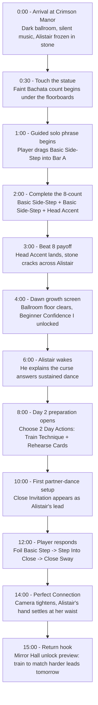

# Meta Horizon Creator Competition: Game Design

## Player Journey Map

**Game Title:** Dancing with Dracula: Crimson Manor

**Journey Focus:** First 15 minutes of onboarding, spanning Day 1 solo dance into Day 2 first partner dance.

---

## First 15 Minutes Flowchart



---

## Journey Table

| Stage | First 30 sec | ~1-3 min | ~3-8 min | ~8-15 min |
|---|---|---|---|---|
| What the player<br>sees & does | The protagonist enters a ruined Grand Ballroom. Alistair stands frozen in stone at the center. | She touches his hand. Music starts. The player completes a guided solo 8-count using Basic Side-Step and Head Accent. | Head Accent lands on Beat 8. Stone cracks, dawn arrives, the Ballroom floor clears, and Alistair wakes. | Day 2 begins. The player trains Technique, rehearses cards, then enters a first partner dance and responds to Close Invitation with Step Into Close. |
| Decision points | Tap the statue hand to answer the manor's invitation. | Drag the guided cards into Bar A / Bar B and attach Head Accent. | Choose the first growth reward: Beginner Confidence I is granted and framed as proof the dance changed her. | Spend 2 Day Actions: Train Technique for +1 Starting Flow and Rehearse Cards to create Foil Basic Step. |
| Difficulty /<br>challenge | No failure pressure. The goal is curiosity and orientation. | Fully guided. The player learns that 8 Beats make a phrase and Styling attaches to movement. | The game introduces consequence without punishment: good timing visibly weakens the curse. | Light tactical pressure. Enter Close before Beat 5 to match Alistair's lead and earn Perfect Connection. |
| Emotional beat | Gothic curiosity: "Why is there a vampire statue in the ballroom?" | Vulnerability: she dances alone, unpolished, while the manor watches. | Wonder and validation: the stone cracks because her dance mattered. | Intimacy and trust: the first real partner dance proves Alistair is not just a story character, but the lead she must learn to read. |
| Natural stop point<br>& return hook | The player wants to know what the statue is. | The first solo phrase is quick enough to finish before stopping. | Dawn reward creates a clean pause: Alistair is awake, the Ballroom changed, and Day 2 is promised. | Mirror Hall unlock preview and harder leads set the next goal: train tomorrow so the next dance can be smoother, closer, and more dangerous. |

---

## Key Onboarding Promise

The first 15 minutes should make one idea unmistakable: **preparation changes the dance, and the dance changes the manor.**

Day 1 proves that dance has supernatural power. Day 2 proves that preparation creates better connection. By the end of the slice, the player has seen the complete emotional loop:

```text
Mortal outsider -> first solo rhythm -> stone cracks -> vampire wakes -> first partner connection -> tomorrow's training goal
```

The player should leave wanting one more session because the next dance is no longer just about waking the castle. It is about becoming skilled enough to meet Alistair's lead.
