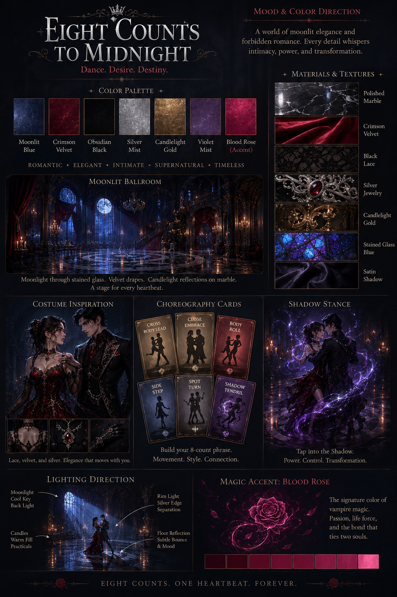
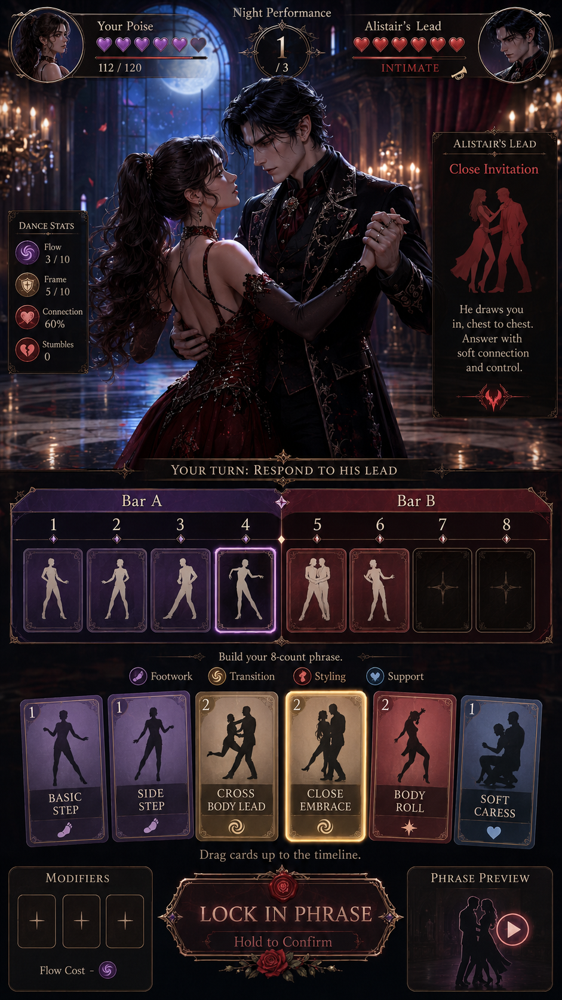
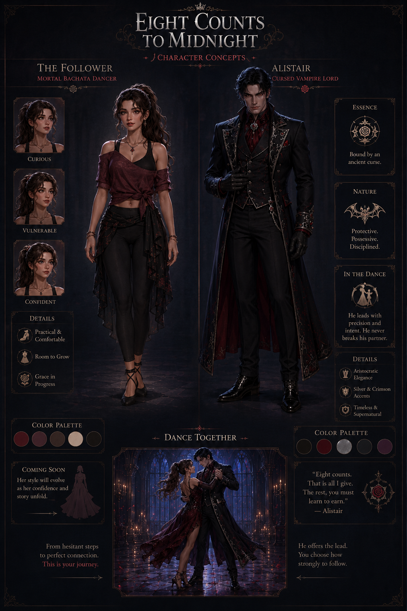
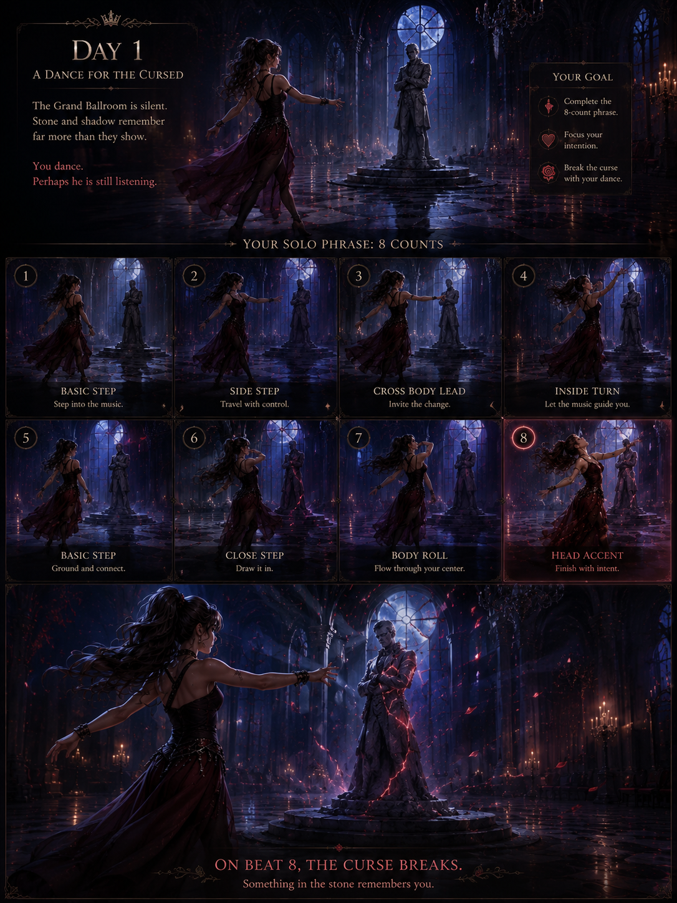
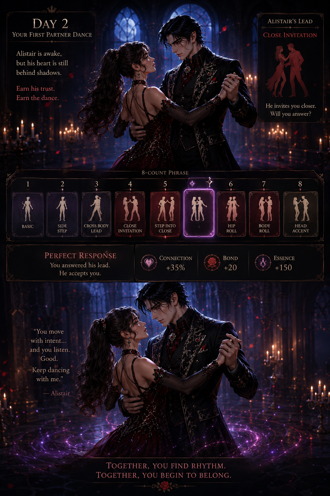
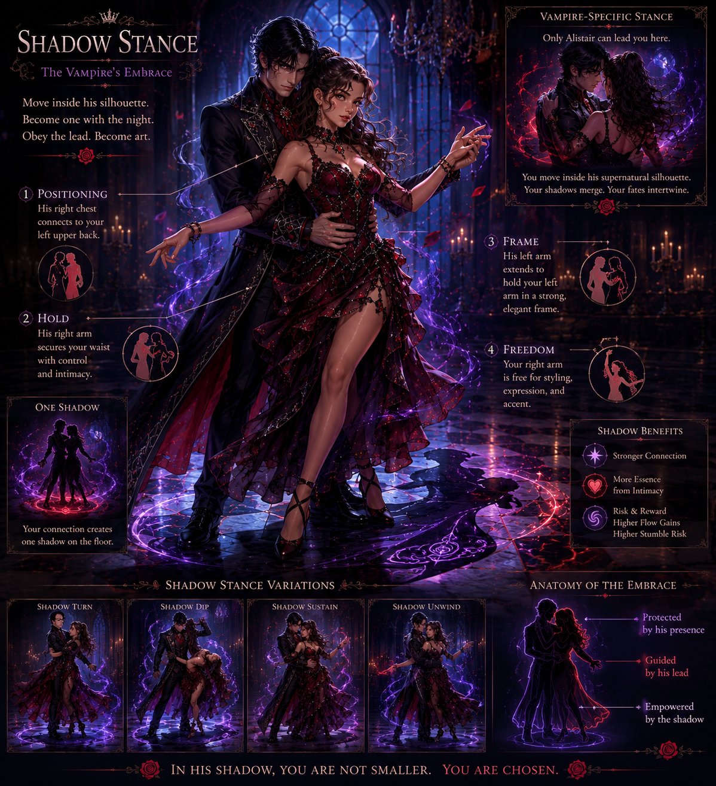
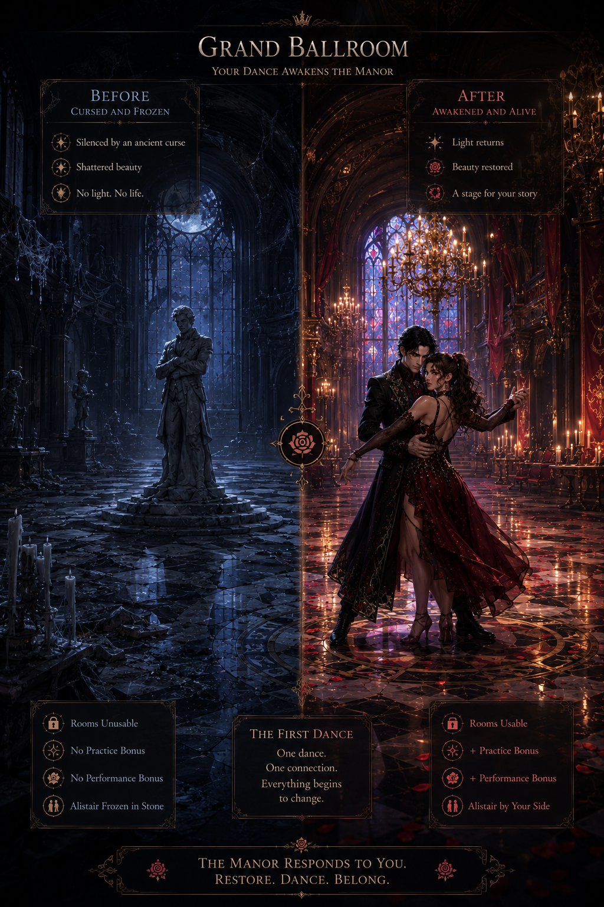

# Meta Horizon Creator Competition: Game Design

## Visual Concept Package

**Game Title:** Dancing with Dracula: Crimson Manor  
**Genre:** Simulation & Management  
**Platform:** Mobile, portrait orientation  

---

## Visual Direction

The game should feel like a gothic romance dance sim, not a horror game. The look is elegant, readable, and mobile-first: moonlit marble, crimson velvet, candlelight, silver jewelry, stained glass, soft supernatural glow, and expressive partner-dance poses.

The visual promise is simple:

```text
A mortal follower grows from careful outsider to confident supernatural dance partner.
The manor changes with her.
```

---

## 1. Color and Mood Reference



**Purpose:** Defines the shared palette and texture language for the whole submission.

| Element | Direction |
|---|---|
| Safe / romantic warmth | Candle gold, skin warmth, soft velvet red. |
| Supernatural tension | Moonlit blue, deep shadow, silver highlights. |
| Vampire magic | Crimson glow with violet-blue edges. |
| Materials | Polished marble, velvet, black lace, silver jewelry, stained glass. |

---

## 2. Gameplay Screen Mockup



**Purpose:** Shows what the player sees during a Night performance.

The screen is built for portrait mobile play:

- Top area: Alistair and the follower dancing in the Grand Ballroom.
- Middle area: the 8-beat phrase timeline split into Bar A and Bar B.
- Bottom area: dance cards, modifier slots, and a lock-in action.

This supports the core hook: **deck-construction IS choreography.**

---

## 3. Character Concept



**Purpose:** Establishes the central relationship and silhouette contrast.

| Character | Visual Role |
|---|---|
| Mortal follower | Human warmth, growth, style evolution, readable dance posture. |
| Alistair | Elegant vampire lead, moonlit restraint, romance and danger. |

The pair should read as dance partners first. Their costumes, height difference, hand positions, and eye contact should make the relationship legible before any dialogue appears.

---

## 4. Key Moment: Day 1 Solo Dance



**Purpose:** Shows the first emotional proof that dance has power.

The follower dances alone in the ruined Grand Ballroom while Alistair is frozen in stone. On Beat 8, her Head Accent lands and cracks spread across his stone shell. This is the first time the player sees:

- Cards becoming movement.
- Movement changing the manor.
- The curse responding to rhythm.

---

## 5. Key Moment: Day 2 First Partner Dance



**Purpose:** Shows the first true connection with Alistair.

Day 2 introduces preparation and partner response. The player trains Technique, rehearses cards, then answers Alistair's **Close Invitation** with **Step Into Close**. The camera tightens as the player earns Perfect Connection.

This moment should feel intimate, controlled, and earned.

---

## 6. Shadow Stance Concept



**Purpose:** Shows the vampire-specific visual differentiator.

Shadow stance is unlocked through Bond. The follower moves inside Alistair's supernatural silhouette, and their shadows merge across the ballroom floor. It should feel romantic and risky, with crimson and violet-blue highlights.

Shadow gives the game a visual idea that only belongs to this concept: Bachata partner dance inside a vampire's aura.

---

## 7. Manor Transformation



**Purpose:** Shows the Simulation & Management payoff.

The manor is not just a background. It is a visible record of player growth.

| Before | After |
|---|---|
| Dark, silent ballroom. Cracked floor. Alistair frozen in stone. | Cleared floor, warmer light, usable dance space, first signs of life. |

This supports the daily loop:

```text
Prepare by day. Dance by night. Grow at dawn.
```

---

## Style Notes

- Keep the camera close enough for romance and dance posture to read on mobile.
- Use warm light for safety, practice, and trust.
- Use cool moonlight for curse pressure and supernatural space.
- Use crimson sparingly for vampire magic, Bond, and major beat payoffs.
- Keep UI clear and grounded: the cards should look playable, not decorative.
- Every image should connect to one of the three core ideas: preparation, choreography, or visible growth.

---

## Package Summary

These seven assets cover the required anchors and the game's main visual promises:

| Required / Useful Element | Asset |
|---|---|
| Color and mood reference | `color_mood_reference.png` |
| Gameplay screen mockup | `gameplay_screen_mockup.png` |
| Character concept | `character_concept_player_and_alistair.png` |
| Key moment panel 1 | `key_moment_day_1.png` |
| Key moment panel 2 | `day_2.png` |
| Unique mechanic visual | `shadow_stance.png` |
| Progression / world change | `before_after_ballroom.png` |
