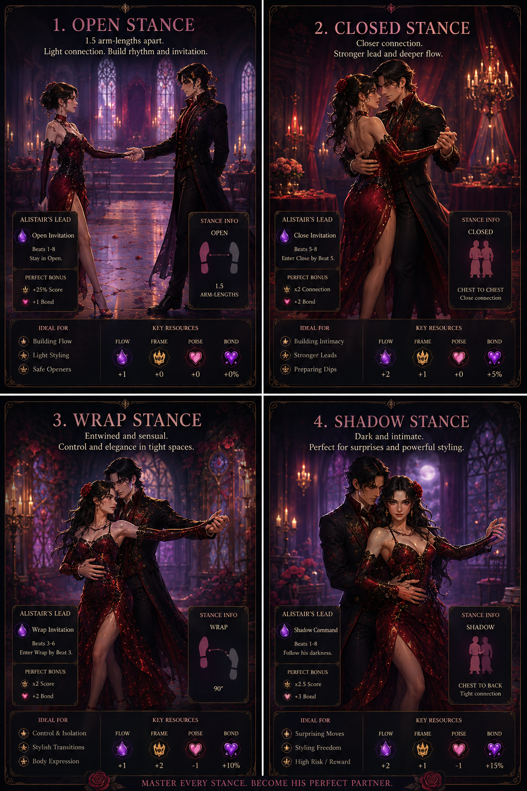

# Meta Horizon Creator Competition: Game Design

## Visual Concept Package

**Game Title:** Eight Counts to Midnight  
**Genre:** Simulation & Management  
**Platform:** Mobile, portrait orientation  

---

## Visual Direction

The game should feel like an elegant gothic romance dance sim. The look is readable and mobile-first: moonlit marble, crimson velvet, candlelight, silver jewelry, stained glass, soft supernatural glow, and expressive partner-dance poses.

All visuals in this package are original concept images generated for this submission.

The visual promise is simple:

```text
Prepare by day. Dance by night. Grow at dawn.
```

The package now follows that story. It starts with management, moves into choreography, then ends with visible growth.

## Submission Anchors

| Guideline Need | Where It Appears |
|---|---|
| Color and mood reference | Section 1: Color and Mood Reference. |
| Gameplay screen mockup | Section 5: Night Gameplay Screen. |
| Mobile readability | Sections 2-5 and Style Notes. |
| Simulation & Management proof | Sections 2-4, 8, and 9. |
| Original visual direction | Character, key moment, stance, and manor transformation images. |

---

## 1. Color and Mood Reference


**Purpose:** Defines the shared palette and texture language for the whole submission.

| Element | Direction |
|---|---|
| Safe / romantic warmth | Candle gold, skin warmth, soft velvet red. |
| Supernatural tension | Moonlit blue, deep shadow, silver highlights. |
| Vampire magic | Crimson glow with violet-blue edges. |
| Materials | Polished marble, velvet, black lace, silver jewelry, stained glass. |

---

## 2. Day Preparation Management


**Purpose:** Shows that the game is Simulation & Management first.

This is the player's main daily decision screen. She has limited action slots and must choose how to prepare before the night performance. The screen makes the tradeoff readable:

| Day Action | What It Changes |
|---|---|
| Train Technique | Improves Frame and Poise for cleaner movement. |
| Rehearse Cards | Improves 8-count combo options. |
| Style Outfit | Changes stats and build focus. |
| Spend Time with Alistair | Increases Bond and Connection. |
| Improve Ballroom | Restores rooms and unlocks features. |

The key visual message: **the player does not simply enter a dance; she prepares a build.**

---

## 3. Card Rehearsal Management


**Purpose:** Shows how deck construction becomes choreography before the dance starts.

This screen supports the technical dependency called out in the Production Plan: every card needs clear metadata. The player can read a card's role, cost, stance, upgrade path, and 8-beat phrase position before committing.

| UI Element | Design Reason |
|---|---|
| Deck grid | Lets the player compare movement options quickly. |
| Selected card preview | Shows card role, stance, and dance intent. |
| Upgrade preview | Makes progression concrete. |
| 8-beat phrase preview | Connects card management to dance timing. |

The screen makes the innovation visible: **deck-construction IS choreography.**

---

## 4. Wardrobe Build Management


**Purpose:** Shows that fashion is a management system, not only cosmetic.

The player styles the follower for a specific build. Shoes, gloves, gowns, jewelry, and perfume change performance stats such as Frame, Poise, Bond, and Styling Cost.

| Wardrobe Choice | Gameplay Meaning |
|---|---|
| Shoes and gloves | Support Frame and control. |
| Gown | Defines visual identity and stance focus. |
| Jewelry and perfume | Support Bond, style, and social fantasy. |
| Build focus | Helps the player prepare for Close, Wrap, or Shadow phrases. |

This ties romance, fashion, and tactics into the same daily loop.

---

## 5. Night Gameplay Screen


**Purpose:** Shows what the player sees during a Night performance.

The screen is built for portrait mobile play:

- Top area: Alistair and the follower dancing in the Grand Ballroom.
- Middle area: the 8-beat phrase timeline split into Bar A and Bar B.
- Bottom area: dance cards, modifier slots, and a lock-in action.

The management screens create the build. This screen tests it through timing, stance, Flow, Frame, Poise, and lead response.

---

## 6. Key Moment: Day 1 Solo Dance


**Purpose:** Shows the first emotional proof that dance has power.

The follower dances alone in the ruined Grand Ballroom while Alistair is frozen in stone. On Beat 8, her Head Accent lands and cracks spread across his stone shell. This is the first time the player sees:

- Cards becoming movement.
- Movement changing the manor.
- The curse responding to rhythm.

---

## 7. Key Moment: Day 2 First Partner Dance


**Purpose:** Shows the first true connection with Alistair.

Day 2 pays off the management screens. The player trains Technique, rehearses cards, then answers Alistair's **Close Invitation** with **Step Into Close**. The camera tightens as the player earns Perfect Connection.

This moment should feel intimate, controlled, and earned.

---

## 8. Dawn Rewards Progression


**Purpose:** Shows how the dance becomes lasting progression.

Dawn closes the loop. The player sees the Ballroom change, earns resources, and gets clear reasons to prepare again tomorrow.

| Reward | What It Reinforces |
|---|---|
| Lumen Essence | Dance restores the manor. |
| Bond | Connection with Alistair grows through performance. |
| Card Material | Better choreography comes from play. |
| Ballroom Progress | The world visibly improves. |

This page makes the management loop concrete: the player can see what changed because of the dance.


The Dawn screen shows the change as UI. The before/after reference shows the same promise as world-state fantasy: dark, silent ballroom becomes cleared floor, warmer light, and usable dance space.

---

## 9. Manor Restoration Management


**Purpose:** Shows the long-term Simulation & Management layer.

Crimson Manor is the player's visible progress map. Rooms unlock better preparation, new cards, new songs, wardrobe options, and story beats.

| Room | Management Role |
|---|---|
| Grand Ballroom | Main performance space and first restoration target. |
| Mirror Hall | Advanced practice and future lead training. |
| Wardrobe Atelier | Outfit builds and style progression. |
| Music Room | Songs, rhythm profiles, and card abilities. |

This gives the game a second progression board beyond the deck: the home itself becomes stronger.

---

## 10. Character and Dance Language


**Purpose:** Establishes the central relationship and silhouette contrast.

| Character | Visual Role |
|---|---|
| Mortal follower | Human warmth, growth, style evolution, readable dance posture. |
| Alistair | Elegant vampire lead, moonlit restraint, romance and danger. |

The pair should read as dance partners first. Their costumes, height difference, hand positions, and eye contact should make the relationship legible before any dialogue appears.



| Stance | Visual Read |
|---|---|
| Open | Light connection, rhythm building, safe opener. |
| Close | Chest-to-chest partner dance, stronger connection, lead response. |
| Wrap | Entwined shape, tighter control, advanced transitions. |
| Shadow | Vampire-specific aura, trust, risk, and supernatural payoff. |


Shadow stance is the vampire-specific visual differentiator. It unlocks through Bond and lets the follower move inside Alistair's supernatural silhouette. It should feel romantic, risky, and trust-driven, with crimson and violet-blue highlights.

This section also supports the production risk named in the Production Plan: the final dance must read as connected lead/follow movement, not two solo loops.

---

## Style Notes

- Keep every screen portrait-first and readable on mobile.
- Lead with management screens before romance key art in the final PDF order.
- Use warm light for safety, practice, and trust.
- Use cool moonlight for curse pressure and supernatural space.
- Use crimson sparingly for vampire magic, Bond, and major beat payoffs.
- Keep UI clear and grounded: cards, stats, rooms, and rewards should look playable, not decorative.
- For PDF layout, pair related images when needed so the package stays focused: Day Prep + Rehearse Cards, Wardrobe + Manor, Day 1 + Day 2, Shadow + Stances.

---

## Package Summary

These assets cover the required anchors and the game's main visual promises:

| Required / Useful Element | Asset |
|---|---|
| Color and mood reference | `color_mood_reference.png` |
| Day management screen | `Day Preparation Management Screen.png` |
| Card rehearsal / upgrade management | `Card Rehearsal Upgrade Management Screen.png` |
| Wardrobe build management | `Wardrobe Build Stats Screen.png` |
| Night gameplay screen mockup | `gameplay_screen_mockup.png` |
| Key moment panel 1 | `key_moment_day_1.png` |
| Key moment panel 2 | `day_2.png` |
| Dawn rewards / progression | `Dawn Rewards Progression Summary.png` |
| Manor restoration management | `Manor Restoration Management Map.png` |
| Character concept | `character_concept_player_and_alistair.png` |
| Stance reference | `4_stances.png` |
| Unique mechanic visual | `shadow_stance.png` |
| Progression / world change reference | `before_after_ballroom.png` |
